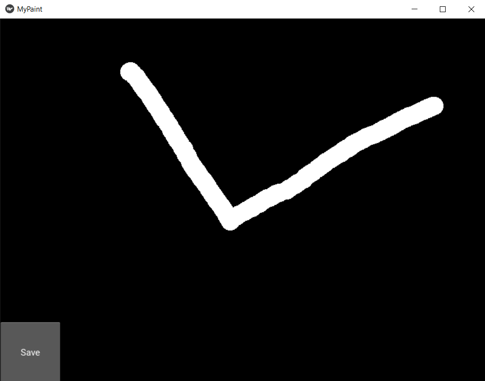

# Differentiation Programming
A vocabulary of functions identifying elementary shapes will be developed using Pytoch's Automatic Differentiation capabilities.

## Installation
Clone the source of this application using: 

`git clone https://github.com/teogoulas/automatic-differentiation.git`

[Python 3 or above](https://www.python.org/getit/) is required for this application.
Install project dependencies using:

`pip3 install -r ./requirements.txt`

## Usage
This application can be used as a command-line application using `main.py`. Command line script works with an ‘command’ 
specifying the two available modes:
* `python3 main.py train`: activates the training process, when the functions are retrained using the configuration 
defined by the user. Four arguments are defined for the `train` command:  
    1. `-e`/ `--epochs`: The number of training epochs (default value: 20).
    2. `-lr`: Learning rate (default value: 0.001).
    3. `-b`/ `--batch`: The batch size (default value: 64).
    4. `-m`/ `--momentum`: The training momentum (default value: 0.5).

    After training completed the models-functions will be saved at `./results/custom` directory for further usage.
    
* `python3 main.py test`: The user-trained or pre-trained functions, will be evaluated on custom shapes drawn by the user.
Once this command is executed the following pop-up window will be shown, where the user will be able to draw any shape.

Upon pressing `Save` the drawn shape will be evaluated by the functions and the elementary shapes will be identified.
    Just one argument is defined for the `test` command:  
    1. `-c`/ `--custom`: If this flag is present the custom trained functions will be loaded for evaluation. 
    Note that `python3 main.py train` command should have already executed, or else the test process will be terminated 
    with an error message. At any other case the pre-trained functions will be used.
    
* `python3 main.py evaluate`: Plots confusion matrix for either user-trained or pre-trained functions
    Just one argument is defined for the `test` command:  
    1. `-c`/ `--custom`: If this flag is present confusion matrix for the custom trained functions will be plotted. 
    Note that `python3 main.py train` command should have already executed, or else the test process will be terminated 
    with an error message. At any other case confusion matrix for the pre-trained functions will be plotted.

Additionally the `--help` / `-h` option can always be used as a command option. Calling `python3 main.py --help` outputs
a general help for the command line interface, with a list of available commands-modes, while `python3 main.py <command> --help`
outputs help for this specific command.

## Author
[Thodoris Goulas](https://github.com/teogoulas) | Software Engineer | [teogoulas@gmail.com](mailto:teogoulas@gmail.com)
